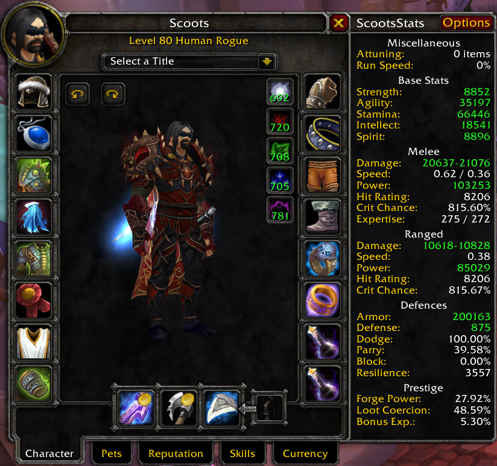
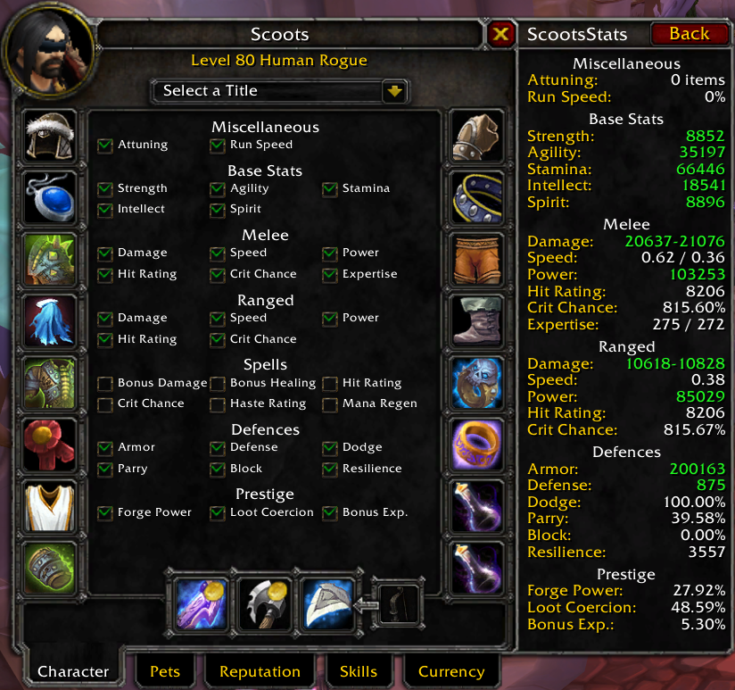
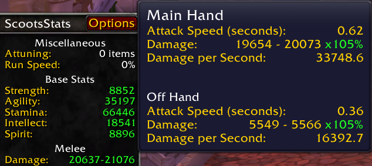
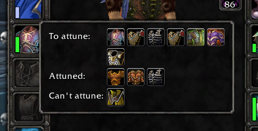

ScootsStats 2.5.2.

## Description ##

This adds a stat panel to the right of your character panel so you don't need to switch between smaller stat panels below your character model, as well as showing a few extra stats.

Also reworks the item-flyout (used by holding alt when hovering over an equipment slot on the character sheet) to group items by attunement status, and to allow all slots to be used in combat.

## Installation ##

Download this repository, then extract the `ScootsStats` subdirectory from the `src` directory into your `World of Warcraft/Interface/AddOns` directory.

## Screenshots ##

