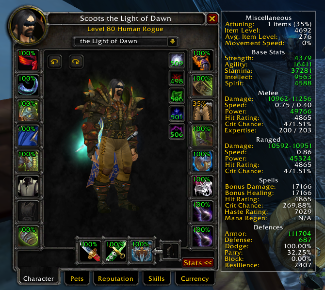
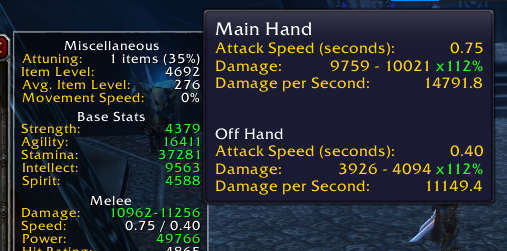

## Description ##

This adds a stat panel to the right of your character panel so you don't need to switch between smaller stat panels below your character model, as well as showing a few extra stats.

Additionally, it adds attunement progress to all equipped item icons.

## Installation ##

Download this repository, then extract the `ScootsStats` subdirectory from the `src` directory into your `World of Warcraft/Interface/AddOns` directory.

## Screenshots ##

